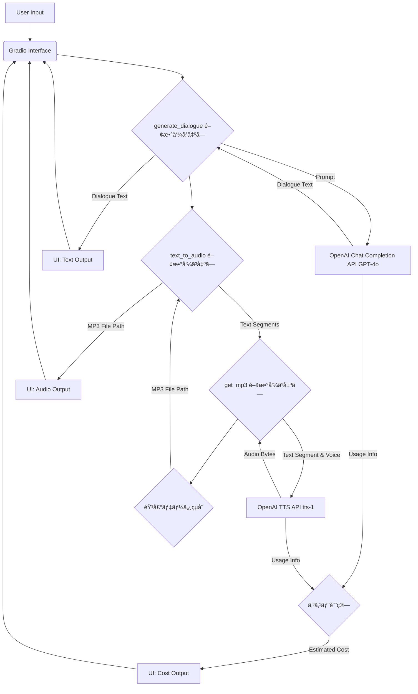

## ã¯ã˜ã‚ã«ï¼šãƒ‘ーソナライズã•ã‚ŒãŸè‹±èªãƒªã‚¹ãƒ‹ãƒ³ã‚°æ•™æã®å¿…è¦æ€§

英èªå­¦ç¿’ã€ç‰¹ã«ãƒªã‚¹ãƒ‹ãƒ³ã‚°åŠ›ã®å‘上ã«ãŠã„ã¦ã€è‡ªèº«ã®èˆˆå‘³ã‚„レベルã«åˆè‡´ã—ãŸæ•™æを見ã¤ã‘ã‚‹ã“ã¨ã¯é‡è¦ãªè¦ç´ ã§ã™ã€‚ã—ã‹ã—ã€å¸‚販ã®æ•™æやオンラインサービスã§ã¯ã€ç‰¹å®šã®ãƒˆãƒ”ックや細ã‹ãªãƒ¬ãƒ™ãƒ«èª¿æ•´ã«å¯¾å¿œã—ãã‚Œãªã„ケースãŒå¤šãã‚ã‚Šã¾ã—ãŸã€‚

ç§è‡ªèº«ã€ç‰¹å®šã®å°‚門分é‡ã«é–¢ã™ã‚‹è­°è«–ã‚’ã€è‡ªèº«ã®è‹±èªãƒ¬ãƒ™ãƒ«ã«é©ã—ãŸé›£æ˜“度ã§èããŸã„ã¨è€ƒãˆã¦ã„ã¾ã—ãŸãŒã€æ—¢å­˜ã®æ•™æã§ã¯ãªã‹ãªã‹è¦‹ã¤ã‘ã‚‹ã“ã¨ãŒã§ãã¾ã›ã‚“ã§ã—ãŸã€‚

ã“ã®èª²é¡Œã‚’解決ã™ã‚‹ãŸã‚ã€ã€Œ**自分ã®èˆˆå‘³ãƒ»ãƒ¬ãƒ™ãƒ«ã«åˆã‚ã›ã¦ã€ãƒªã‚¹ãƒ‹ãƒ³ã‚°æ•™æを生æˆã§ãるツール**ã€ã®å¿…è¦æ€§ã‚’æ„Ÿã˜ã€é–‹ç™ºã«è‡³ã‚Šã¾ã—ãŸã€‚本記事ã§ã¯ã€ãã®é–‹ç™ºçµŒç·¯ã€æŠ€è¡“çš„ãªå®Ÿè£…ã«ã¤ã„ã¦å…±æœ‰ã—ã¾ã™ã€‚

## デモ動画
@[tweet](https://x.com/rynskrmt/status/1905931286314905982)


## 課題設定：ç†æƒ³çš„ãªè‹±èªãƒªã‚¹ãƒ‹ãƒ³ã‚°æ•™æã®è¦ä»¶

開発ã«ã‚ãŸã‚Šã€ç†æƒ³çš„ãªãƒªã‚¹ãƒ‹ãƒ³ã‚°æ•™æã«å¿…è¦ãªè¦ä»¶ã‚’以下ã®ã‚ˆã†ã«å®šç¾©ã—ã¾ã—ãŸã€‚

1.  **トピックã®è‡ªç”±åº¦:** ユーザーãŒä»»æ„ã®ã‚­ãƒ¼ãƒ¯ãƒ¼ãƒ‰ã‚’指定ã—ã€ãã‚Œã«åŸºã¥ã„ãŸå†…容ãŒç”Ÿæˆã•ã‚Œã‚‹ã“ã¨ã€‚
2.  **レベルã®æœ€é©åŒ–:** CEFR基準（A1〜C2）ã§é›£æ˜“度を指定ã§ãã€èªå½™ã‚„表ç¾ãŒèª¿æ•´ã•ã‚Œã‚‹ã“ã¨ã€‚
3.  **自然ãªä¼šè©±å½¢å¼:** 複数ã®è©±è€…ã«ã‚ˆã‚‹ã€ãƒªã‚¢ãƒ«ãªå¯¾è©±å½¢å¼ï¼ˆPodcast風）ã§ã‚ã‚‹ã“ã¨ã€‚

ä¼¼ãŸã‚ˆã†ãªãƒ„ールã¨ã—ã¦ã€Googleã®[NotebookLM](https://notebooklm.google/)ãŒã‚ã‚Šã¾ã™ã€‚  
ãŸã ã€ã“ã¡ã‚‰ã¯è‹±èªåŠ›ãŒã‚る程度ã‚る人å‘ã‘ã§ã€å‡ºåŠ›ã•ã‚Œã‚‹å†…容ã®é›£æ˜“度を調整ã™ã‚‹ã®ãŒé›£ã—ã„ã¨æ„Ÿã˜ã¾ã—ãŸã€‚  
英èªåŠ›ã«è‡ªä¿¡ã®ãªã„自分ã«ã¨ã£ã¦ã¯ã€ã‚‚ã†å°‘ã—レベルã«åˆã‚ã›ãŸã‚³ãƒ³ãƒ†ãƒ³ãƒ„ãŒã»ã—ã„ã€ã¨ã„ã†ã®ãŒæ­£ç›´ãªã¨ã“ã‚ã§ã—ãŸã€‚  

ãã“ã§ã€ã€Œè‡ªåˆ†ã®èˆˆå‘³ã®ã‚る話題をã€è‡ªåˆ†ã®ãƒ¬ãƒ™ãƒ«ã«åˆã‚ã›ãŸè‹±èªã§ã€éŸ³å£°ä»˜ãã§å­¦ã¹ãŸã‚‰ä¾¿åˆ©ã ãªã€ã¨æ€ã„ã€ã“ã®ãƒ„ールを作りã¾ã—ãŸã€‚  


## 開発ã—ãŸã‚‚ã®ï¼šã€ŒCEFR English Podcast Generatorã€

上記ã®èª²é¡Œã‚’解決ã™ã‚‹ãŸã‚ã«é–‹ç™ºã—ãŸã®ãŒã€**「CEFR English Podcast Generatorã€**ã§ã™ã€‚

ã“ã‚Œã¯ã€OpenAI API (GPT-4oã«ã‚ˆã‚‹ãƒ†ã‚­ã‚¹ãƒˆç”Ÿæˆã€TTSã«ã‚ˆã‚‹éŸ³å£°åˆæˆ) 㨠Gradio (UIフレームワーク) を組ã¿åˆã‚ã›ãŸPythonアプリケーションã§ã™ã€‚

**主ãªæ©Ÿèƒ½:**

*   ユーザーãŒæŒ‡å®šã—ãŸ**トピックã€CEFRレベルã€å˜èªæ•°ã€è¿½åŠ æƒ…å ±**ã«åŸºã¥ãã€AIãŒ**英会話スクリプト**を生æˆã€‚
*   生æˆã•ã‚ŒãŸã‚¹ã‚¯ãƒªãƒ—トを元ã«ã€**MP3å½¢å¼ã®éŸ³å£°ãƒ•ã‚¡ã‚¤ãƒ«**を自動生æˆã€‚

ã“ã‚Œã«ã‚ˆã‚Šã€å®šç¾©ã—ãŸè¦ä»¶ã‚’満ãŸã™ãƒ‘ーソナライズã•ã‚ŒãŸãƒªã‚¹ãƒ‹ãƒ³ã‚°æ•™æã®ã‚ªãƒ³ãƒ‡ãƒãƒ³ãƒ‰ç”ŸæˆãŒå¯èƒ½ã«ãªã‚Šã¾ã—ãŸã€‚

## 実装ã®è©³ç´°

アプリケーションã®ã‚³ã‚¢æ©Ÿèƒ½ã¯Pythonã§å®Ÿè£…ã—ã€ä¸»è¦ãªå‡¦ç†ã¯OpenAI APIを利用ã—ã¦ã„ã¾ã™ã€‚

*   **言èª:** Python 3.x
*   **AI API:** OpenAI API
    *   テキスト生æˆ: `gpt-4o` (環境変数 `TEXT_MODEL` ã§æŒ‡å®š)
    *   音声åˆæˆ: `tts-1` (環境変数 `AUDIO_MODEL` ã§æŒ‡å®š)
*   **Web UI フレームワーク:** Gradio
*   **ライブラリ:** `python-dotenv`, `openai`

### システム構æˆã¨å‡¦ç†ãƒ•ãƒ­ãƒ¼
ã–ã£ãã‚Šã„ã†ã¨ã€ã€Œ**テキスト生æˆãƒ¢ãƒ‡ãƒ«ã§Podcastã®å°æœ¬ã‚’生æˆã—ã€å„センテンスã”ã¨ã«éŸ³å£°åŒ–ã—ã€ãれらを全ã¦çµåˆã™ã‚‹**ã€ã¨ã„ã†å‡¦ç†ã‚’ã•ã›ã¦ã„ã¾ã™ã€‚  
念ã®ãŸã‚ã€å…¨ä½“ã®å‡¦ç†ãƒ•ãƒ­ãƒ¼å›³ã‚’載ã›ã¦ãŠãã¾ã™ã€‚

```mermaid
graph TB
    A[User Input] --> B(Gradio Interface);
    B --> C{generate_dialogue 関数呼ã³å‡ºã—};
    C -- Prompt --> D[OpenAI Chat Completion API GPT-4o];
    D -- Dialogue Text --> C;
    C --> E{text_to_audio 関数呼ã³å‡ºã—};
    E -- Text Segments --> F{get_mp3 関数呼ã³å‡ºã—};
    F -- Text Segment & Voice --> G[OpenAI TTS API tts-1];
    G -- Audio Bytes --> F;
    F --> H{音声データçµåˆ};
    H -- MP3 File Path --> E;
    C -- Dialogue Text --> I[UI: Text Output];
    E -- MP3 File Path --> J[UI: Audio Output];
    D & G -- Usage Info --> K{コスト計算};
    K -- Estimated Cost --> L[UI: Cost Output];
    I & J & L --> B;
```

### 1. ä¼šè©±ãƒ†ã‚­ã‚¹ãƒˆç”Ÿæˆ (`generate_dialogue`)

中核ã¨ãªã‚‹ã®ãŒã€GPTモデルã«å¯¾ã™ã‚‹ãƒ—ロンプト設計ã§ã™ã€‚æ„図ã—ãŸé€šã‚Šã®å¯¾è©±å½¢å¼ã€å†…容ã€é›£æ˜“度ã€é•·ã•ã‚’実ç¾ã™ã‚‹ãŸã‚ã«ã€è©³ç´°ãªæŒ‡ç¤ºã‚’ä¸ãˆã¦ã„ã¾ã™ã€‚

```python
# プロンプトã®ä¸»è¦éƒ¨åˆ†
prompt = f"""
You are tasked with generating an engaging, educational and fun podcast dialogue designed specifically for English language learners at CEFR level {cefr_level}.
The conversation should focus on the topic: '{topic}'. {additional_info_text}
Craft a natural, lively, and informative discussion between two speakers ({SPEAKER_1_NAME} and {SPEAKER_2_NAME})...
IMPORTANT: The dialogue MUST be EXACTLY {word_count} words in total length. This is a strict requirement.
...
Your dialogue must:
    - Be EXACTLY {word_count} words total. Count carefully.
    - Clearly alternate turns between {SPEAKER_1_NAME} and {SPEAKER_2_NAME}.
    - Avoid special characters or markdown formatting.
    - Define any specialized terms clearly and simply...
    - Include a few jokes and interesting facts.
    - Have a clear introduction, body with multiple discussion points, and conclusion.
Use the following format:
    {SPEAKER_1_NAME}: sentence
    {SPEAKER_2_NAME}: sentence
...
"""

# API呼ã³å‡ºã—
response = client.chat.completions.create(
    model=TEXT_MODEL,
    messages=[{"role": "user", "content": prompt}],
    max_completion_tokens=max_tokens, # å˜èªæ•°ã‹ã‚‰æ¨å®š
    temperature=0.7, # ã‚る程度ã®å¤šæ§˜æ€§ã‚’許容
)
dialogue_content = response.choices[0].message.content

# コスト計算
calculate_text_cost(response, TEXT_MODEL)
```

### 2. テキストã‹ã‚‰éŸ³å£°ã¸ã®å¤‰æ› (`text_to_audio`, `get_mp3`)

生æˆã•ã‚ŒãŸãƒ†ã‚­ã‚¹ãƒˆã¯ã€æ”¹è¡Œã§åŒºåˆ‡ã‚‰ã‚ŒãŸå„発話ã”ã¨ã«TTS APIã¸é€ä¿¡ã•ã‚Œã¾ã™ã€‚

```python
def text_to_audio(text, speaker_1_voice, speaker_2_voice, audio_model):
    # ... (一時ファイルã€ãƒ­ã‚°ã®æº–å‚™) ...
    dialogue_lines = text.split('\n')
    with open(file_path, 'wb') as f:
        for line_idx, line in enumerate(dialogue_lines):
            # スピーカー判定ã¨å†…容抽出
            if line.startswith(f"{SPEAKER_1_NAME}:"):
                voice = speaker_1_voice
                content = line.replace(f"{SPEAKER_1_NAME}:", "").strip()
            elif line.startswith(f"{SPEAKER_2_NAME}:"):
                voice = speaker_2_voice
                content = line.replace(f"{SPEAKER_2_NAME}:", "").strip()
            else:
                continue # スキップ

            if not content: continue # スキップ

            try:
                # ストリーミングAPIを利用
                with client.audio.speech.with_streaming_response.create(
                    model=audio_model, voice=voice, input=content,
                ) as response:
                    # å–å¾—ã—ãŸã‚ªãƒ¼ãƒ‡ã‚£ã‚ªãƒãƒ£ãƒ³ã‚¯ã‚’ファイルã«è¿½è¨˜
                    for chunk in response.iter_bytes():
                        f.write(chunk)
                # TTSコスト計算
                calculate_tts_cost(content, audio_model)
            except Exception as e:
                # エラーログ記録 (リトライ処ç†ã‚‚検è¨å¯èƒ½)
                log_error(f"TTS Error on line {line_idx+1}: {e}", content)
    return file_path

def get_mp3(text, voice, audio_model): # text_to_audioã‹ã‚‰å‘¼ã³å‡ºã•ã‚Œã‚‹æƒ³å®š
    # (calculate_tts_cost, client.audio.speech... ã®å®Ÿè£…)
    pass
```

**実装ã®ãƒã‚¤ãƒ³ãƒˆ:**

*   **発話å˜ä½ã§ã®å‡¦ç†:** テキスト全体を一度ã«TTSã«ã‹ã‘ã‚‹ã®ã§ã¯ãªãã€å„スピーカーã®ç™ºè©±ã‚’個別ã«å‡¦ç†ã€‚ã“ã‚Œã«ã‚ˆã‚Šã€ç•°ãªã‚‹ãƒœã‚¤ã‚¹ï¼ˆ`alloy`, `echo`等）を割り当ã¦å¯èƒ½ã«ã€‚
*   **ストリーミング応答ã®åˆ©ç”¨:** `with_streaming_response` を用ã„ã‚‹ã“ã¨ã§ã€APIã‹ã‚‰ã®éŸ³å£°ãƒ‡ãƒ¼ã‚¿ã‚’ãƒãƒ£ãƒ³ã‚¯ã§å—ã‘å–ã‚Šã€ãƒ¡ãƒ¢ãƒªæ¶ˆè²»ã‚’抑ãˆã¤ã¤ãƒ•ã‚¡ã‚¤ãƒ«ã«æ›¸ãè¾¼ã‚ã¾ã™ã€‚é•·ã„会話ã§ã‚‚効ç‡çš„ã«å‡¦ç†å¯èƒ½ã§ã™ã€‚
*   **ãƒã‚¤ãƒˆåˆ—ã®çµåˆ:** å„発話ã‹ã‚‰å¾—られãŸMP3データã®ãƒã‚¤ãƒˆåˆ—ã‚’å˜ç´”ã«ãƒ•ã‚¡ã‚¤ãƒ«ã«è¿½è¨˜ã—ã¦ã„ãã“ã¨ã§ã€æœ€çµ‚çš„ãªä¸€ã¤ã®éŸ³å£°ãƒ•ã‚¡ã‚¤ãƒ«ã‚’生æˆã—ã¦ã„ã¾ã™ã€‚
*   **エラーãƒãƒ³ãƒ‰ãƒªãƒ³ã‚°ã¨ãƒ­ã‚°:** TTS APIã¯ãƒãƒƒãƒˆãƒ¯ãƒ¼ã‚¯ã‚„入力内容ã«ã‚ˆã£ã¦ã‚¨ãƒ©ãƒ¼ã‚’è¿”ã™å¯èƒ½æ€§ãŒã‚ã‚‹ãŸã‚ã€`try-except` ã«ã‚ˆã‚‹ä¾‹å¤–処ç†ã¨ã€å•é¡Œç™ºç”Ÿç®‡æ‰€ã‚’特定ã™ã‚‹ãŸã‚ã®ãƒ­ã‚°å‡ºåŠ›ãŒé‡è¦ã§ã™ã€‚

### 3. Gradioã«ã‚ˆã‚‹ã‚·ãƒ³ãƒ—ルãªUI構築

ユーザーインターフェースã«ã¯Gradioã‚’æ¡ç”¨ã—ã¾ã—ãŸã€‚Pythonコードã®ã¿ã§å¯¾è©±çš„ãªWeb UIを迅速ã«æ§‹ç¯‰ã§ãる点ãŒãƒ¡ãƒªãƒƒãƒˆã§ã™ã€‚

```python
import gradio as gr

# ... (generate_audio_dialogue 関数ã®å®šç¾©) ...

ui = gr.Interface(
    fn=generate_audio_dialogue,
    inputs=[
        gr.Textbox(label="トピック", placeholder="e.g., Indie Hacking"),
        gr.Textbox(label="追加情報（オプション）", lines=3),
        gr.Dropdown(choices=["A1", "A2", "B1", "B2", "C1", "C2"], label="CEFRレベル", value="B1"),
        gr.Slider(minimum=100, maximum=5000, value=300, step=50, label="å˜èªæ•°"),
    ],
    outputs=[
        gr.Textbox(label="トランスクリプト", lines=15), # linesã§é«˜ã•ã‚’指定
        gr.Audio(label="音声ファイル", type="filepath"),
        gr.Textbox(label="API利用料金"),
    ],
    title="CEFR English Podcast ジェãƒãƒ¬ãƒ¼ã‚¿ãƒ¼",
    description="トピックã¨CEFRレベルã«åŸºã¥ã„ã¦è‹±èªå­¦ç¿’者å‘ã‘会話音声教æを生æˆã—ã¾ã™ã€‚"
)

if __name__ == "__main__":
    ui.launch()
```
Gradioã®`Interface`クラスã«å¿…è¦ãªé–¢æ•°ã¨å…¥å‡ºåŠ›ã‚³ãƒ³ãƒãƒ¼ãƒãƒ³ãƒˆã‚’指定ã™ã‚‹ã ã‘ã§ã€åŸºæœ¬çš„ãªUIãŒå®Œæˆã—ã¾ã™ã€‚

## å°å…¥ã¨åˆ©ç”¨æ–¹æ³•

以下ã®æ‰‹é †ã§ãƒ­ãƒ¼ã‚«ãƒ«ç’°å¢ƒã§å®Ÿè¡Œã§ãã¾ã™ã€‚

1.  **リãƒã‚¸ãƒˆãƒªã®ã‚¯ãƒ­ãƒ¼ãƒ³:**
    ```bash
    git clone https://github.com/rynskrmt/CEFR-English-Podcast-Generator.git
    cd CEFR-English-Podcast-Generator
    ```
2.  **ä¾å­˜ãƒ‘ッケージã®ã‚¤ãƒ³ã‚¹ãƒˆãƒ¼ãƒ«:**
    ```bash
    pip install -r requirements.txt
    ```
3.  **環境変数ã®è¨­å®š:**
    ルートディレクトリã«`.env`ファイルを作æˆã—ã€OpenAI APIキーを記述ã—ã¾ã™ã€‚å¿…è¦ã«å¿œã˜ã¦ãƒ¢ãƒ‡ãƒ«åãªã©ã‚‚変更å¯èƒ½ã§ã™ã€‚
    ```dotenv
    OPENAI_API_KEY=sk-xxxxxxxxxxxxxxxxxxxxxxxxxxxxxxx
    TEXT_MODEL=gpt-4o
    AUDIO_MODEL=tts-1
    SPEAKER_1_VOICE=alloy
    SPEAKER_2_VOICE=echo
    SPEAKER_1_NAME="Speaker 1"
    SPEAKER_2_NAME="Speaker 2"
    ```
4.  **アプリケーションã®èµ·å‹•:**
    ```bash
    python app.py
    ```
5.  **ブラウザã§ã‚¢ã‚¯ã‚»ã‚¹:**
    ターミナルã«è¡¨ç¤ºã•ã‚Œã‚‹ãƒ­ãƒ¼ã‚«ãƒ«URL（例: `http://127.0.0.1:7860`）を開ãã€ã‚¤ãƒ³ã‚¿ãƒ¼ãƒ•ã‚§ãƒ¼ã‚¹ã‹ã‚‰æ“作ã—ã¾ã™ã€‚

## ã¾ã¨ã‚

本記事ã§ã¯ã€ãƒ‘ーソナライズã•ã‚ŒãŸè‹±èªãƒªã‚¹ãƒ‹ãƒ³ã‚°æ•™æを生æˆã™ã‚‹ãƒ„ール「CEFR English Podcast Generatorã€ã®é–‹ç™ºã«ã¤ã„ã¦ç´¹ä»‹ã—ã¾ã—ãŸã€‚OpenAI APIã¨Gradioを活用ã™ã‚‹ã“ã¨ã§ã€å½“åˆæŠ±ãˆã¦ã„ãŸã€Œè‡ªåˆ†ã«åˆã£ãŸæ•™æãŒè¦‹ã¤ã‹ã‚‰ãªã„ã€ã¨ã„ã†èª²é¡Œã‚’効æœçš„ã«è§£æ±ºã§ãã¾ã—ãŸã€‚
今å›ã¯ã¾ãšã€æ‰‹è»½ã«æ‰±ãˆã‚‹OpenAIã®TTSを使ã£ã¦éŸ³å£°ã‚’生æˆã—ã¦ã„ã¾ã™ãŒã€å°†æ¥çš„ã«ã¯ã€Sesameã® [CSM](https://github.com/SesameAILabs/csm) ã®ã‚ˆã†ãªã€ã‚ˆã‚Šè‡ªç„¶ã§ãƒªã‚¢ãƒ«ãªä¼šè©±éŸ³å£°ã‚’å–り入れãŸå½¢ã«ã‚‚発展ã•ã›ã¦ã„ããŸã„ã¨è€ƒãˆã¦ã„ã¾ã™ã€‚  
より実際ã®ä¼šè©±ã«è¿‘ã„発音や抑æšã‚’å–り入れるã“ã¨ã§ã€ã€Œç”ŸããŸè‹±èªã€ã«è§¦ã‚Œã‚‰ã‚Œã‚‹ç’°å¢ƒã‚’好ããªã ã‘æµ´ã³ã‚Œã‚‹ç’°å¢ƒã‚’作りãŸã„ã§ã™ï¼

## ソースコード - GitHub
**ソースコードã¯ã“ã¡ã‚‰ã§å…¬é–‹ã—ã¦ã„ã¾ã™:**
https://github.com/rynskrmt/CEFR-English-Podcast-Generator

フィードãƒãƒƒã‚¯ã‚„改善æ案ãªã©ã€ãŠæ°—軽ã«Issueã‚„Pull Requestã‚’ãŠå¯„ã›ãã ã•ã„。
